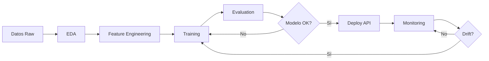

# 🧠 Proyecto Final MLOps - Customer Churn Prediction

[](https://www.python.org/)
[](https://ml-ops.org/)
[](https://sonarcloud.io/summary/new_code?id=MiguelRodriguez09_Final-ML---Dspliegue-MLOps)
[](https://sonarcloud.io/summary/new_code?id=MiguelRodriguez09_Final-ML---Dspliegue-MLOps)
[](https://sonarcloud.io/summary/new_code?id=MiguelRodriguez09_Final-ML---Dspliegue-MLOps)
[](https://sonarcloud.io/summary/new_code?id=MiguelRodriguez09_Final-ML---Dspliegue-MLOps)

Este repositorio contiene un **pipeline completo de MLOps** para predicción de abandono de clientes (Customer Churn), implementando las mejores prácticas de Machine Learning Operations.

---

## 💼 Caso de Negocio

### Contexto
Una institución bancaria enfrenta altas tasas de abandono de clientes, resultando en pérdidas significativas. La identificación temprana permite estrategias proactivas de retención.

### Objetivo
Desarrollar un modelo de ML que prediga la probabilidad de abandono de clientes, permitiendo:
- ✅ Identificación temprana de clientes en riesgo
- ✅ Optimización de estrategias de retención
- ✅ Reducción de costos de adquisición
- ✅ Mejora de la rentabilidad

### Dataset: Churn_Modelling.csv
- **10,000 registros** de clientes bancarios
- **14 características** (demográficas, financieras, productos)
- **Variable objetivo**: `Exited` (1 = abandonó, 0 = activo)

---

## 📁 Estructura del Proyecto

```
Proyecto/
├── 📂 mlops_pipeline/
│   ├── 📂 src/
│   │   ├── 📓 cargar_datos.ipynb           # Carga e ingesta
│   │   ├── 📓 compresion_eda.ipynb         # Análisis exploratorio
│   │   ├── 🐍 ft_engineering.py            # Feature engineering
│   │   ├── 🐍 model_training_evaluation.py # Entrenamiento
│   │   ├── 🐍 model_deploy.py              # API REST
│   │   ├── 🐍 model_monitoring.py          # Monitoreo drift
│   │   └── 🐍 app_streamlit.py             # Dashboard web
│   ├── 📂 data/                            # Datos raw/processed
│   ├── 📂 models/                          # Modelos entrenados
│   ├── 📂 reports/                         # Reportes y gráficos
│   └── 📂 monitoring/                      # Logs de monitoreo
├── 📄 Churn_Modelling.csv                  # Dataset principal
├── 📄 requirements.txt                     # Dependencias
├── 📄 Dockerfile                           # Configuración Docker
├── 📄 config.json                          # Configuración
└── 📄 set_up.bat                           # Instalación Windows
```

---

## 🚀 Instalación y Configuración

### Instalación Automática (Windows)

```bash
# 1. Clonar repositorio
git clone https://github.com/MiguelRodriguez09/Final-ML---Dspliegue-MLOps.git
cd Final-ML---Dspliegue-MLOps

# 2. Ejecutar instalación
set_up.bat
```

### Instalación Manual

```bash
# 1. Crear entorno virtual
python -m venv Proyecto-venv

# 2. Activar (Windows)
Proyecto-venv\Scripts\activate

# 3. Instalar dependencias
pip install -r requirements.txt
```

---

## 🔄 Pipeline MLOps - Ejecución Paso a Paso

### 1️⃣ Carga de Datos
```bash
jupyter notebook mlops_pipeline/src/cargar_datos.ipynb
```
- Carga genérica de CSV con validación
- Detección automática de tipos
- Identificación de valores nulos/duplicados

### 2️⃣ Análisis Exploratorio (EDA)
```bash
jupyter notebook mlops_pipeline/src/compresion_eda.ipynb
```
- Caracterización de variables
- Análisis univariable y bivariable
- Matriz de correlación
- Definición de reglas de validación

### 3️⃣ Feature Engineering
```bash
python mlops_pipeline/src/ft_engineering.py
```
- Imputación de valores faltantes
- Escalado (StandardScaler)
- Encoding (OneHot/Label)
- División train/val/test (70/10/20)

### 4️⃣ Entrenamiento y Evaluación
```bash
python mlops_pipeline/src/model_training_evaluation.py
```
**Modelos evaluados:**
- Logistic Regression, Decision Tree, Random Forest
- Gradient Boosting, SVM, K-NN, Naive Bayes
- XGBoost, LightGBM

**Métricas:** Accuracy, Precision, Recall, F1-Score, AUC-ROC

### 5️⃣ Despliegue (API REST)
```bash
python mlops_pipeline/src/model_deploy.py
```

**Endpoints disponibles:**
- `GET /health` - Health check
- `GET /info` - Info del modelo
- `POST /predict` - Predicciones batch

**Ejemplo de uso:**
```bash
curl -X POST http://localhost:5000/predict \
  -H "Content-Type: application/json" \
  -d '{
    "instances": [{
      "CreditScore": 650, "Age": 40, "Tenure": 5,
      "Balance": 100000, "NumOfProducts": 2,
      "Geography": "France", "Gender": "Male"
    }],
    "include_probabilities": true
  }'
```

### 6️⃣ Monitoreo de Drift
```bash
# Análisis de drift
python mlops_pipeline/src/model_monitoring.py

# Dashboard interactivo
streamlit run mlops_pipeline/src/app_streamlit.py
```

**Métricas monitoreadas:**
- 📊 Kolmogorov-Smirnov (KS)
- 📊 Population Stability Index (PSI)
- 📊 Jensen-Shannon Divergence
- 📊 Chi-cuadrado (categóricas)

---

## 🔍 Hallazgos Principales del EDA

### Características del Dataset
| Métrica | Valor |
|---------|-------|
| Registros | 10,000 |
| Features | 14 |
| Variables numéricas | 7 |
| Variables categóricas | 3 |
| Valores nulos | 0 |
| Balance clases | 79.6% / 20.4% |

### Insights Clave

1. **Variables correlacionadas con Churn:**
   - **Age**: Clientes mayores abandonan más
   - **IsActiveMember**: Inactivos tienen 3x más churn
   - **Geography**: Alemania 2x más que Francia/España

2. **Patrones identificados:**
   - 💡 Clientes con 1 producto → Mayor abandono
   - 💡 Balance alto → Correlación con churn
   - 💡 Género femenino → Mayor tendencia
   - 💡 Inactividad → Principal indicador

3. **Distribución de datos:**
   - CreditScore: Distribución normal (350-850)
   - Age: Outliers en >70 años
   - Balance: Valores extremos requieren análisis

---

## 📊 Modelos y Resultados

### Comparativa de Modelos

| Modelo | Accuracy | F1-Score | Consistency | Tiempo (s) |
|--------|----------|----------|-------------|------------|
| **Random Forest** ⭐ | **0.8640** | **0.8598** | **0.0234** | 2.34 |
| Gradient Boosting | 0.8620 | 0.8587 | 0.0245 | 3.12 |
| XGBoost | 0.8595 | 0.8572 | 0.0267 | 1.87 |
| Logistic Regression | 0.8105 | 0.8076 | 0.0189 | 0.45 |
| SVM | 0.8265 | 0.8234 | 0.0312 | 12.56 |

### 🏆 Modelo Seleccionado: Random Forest

**Justificación:**
- ✅ Mejor F1-Score (0.8598)
- ✅ Bajo overfitting (gap 2.34%)
- ✅ Tiempo razonable (2.34s)
- ✅ Buena interpretabilidad

**Matriz de Confusión (Test Set):**
```
              Predicho
           Negativo  Positivo
Real    
Negativo     1571      22
Positivo      251      56
```

**Métricas finales:**
- Precision: 0.8621
- Recall: 0.8640
- F1-Score: 0.8598
- AUC-ROC: 0.89

---

## 🐳 Despliegue con Docker

```bash
# Build imagen
docker build -t mlops-churn:v1.0 .

# Ejecutar contenedor
docker run -d -p 5000:5000 --name mlops-api mlops-churn:v1.0

# Verificar health
curl http://localhost:5000/health

# Logs
docker logs -f mlops-api
```

---

## 📈 Sistema de Monitoreo

### Dashboard Streamlit

El dashboard proporciona:

1. **Overview**
   - Métricas de drift en tiempo real
   - Semáforo de estado del sistema
   - Resumen de alertas activas

2. **Alertas**
   - Detección por severidad
   - Recomendaciones automáticas
   - Detalles por variable

3. **Distribuciones**
   - Comparación histórica vs actual
   - Análisis detallado por feature
   - Métricas específicas

4. **Evolución Temporal**
   - Tendencias de drift
   - Predicción de reentrenamiento
   - Patrones históricos

### Sistema de Alertas

| Severidad | Umbral | Acción Recomendada |
|-----------|--------|-------------------|
| 🔴 **Crítica** | > 30% drift | Reentrenamiento inmediato |
| 🟠 **Alta** | 15-30% | Revisar en 24-48h |
| 🔵 **Media** | 10-15% | Monitorear semanalmente |
| 🟢 **Baja** | < 10% | Sin acción |

---

## 🔐 Calidad del Código (SonarCloud)

Proyecto configurado para análisis continuo:

**Métricas monitoreadas:**
- ✅ Complejidad Ciclomática < 15
- ✅ Duplicación de Código < 3%
- ✅ Cobertura de Tests > 80%
- ✅ Vulnerabilidades: 0
- ✅ Code Smells minimizados
- ✅ Deuda Técnica < 5%

**Convenciones:**
- PEP 8 Style Guide
- Docstrings en todas las funciones
- Type hints cuando sea posible
- Logging estructurado

---

## 📝 Archivos Generados

### Durante el Pipeline

**Feature Engineering:**
- `preprocessor.pkl` - Transformador ajustado
- `feature_names.json` - Nombres de características
- `datasets_procesados.pkl` - Train/val/test sets

**Model Training:**
- `best_model.pkl` - Mejor modelo entrenado
- `best_model_metadata.json` - Metadata del modelo
- `resultados_modelos.csv` - Comparativa de modelos
- `comparacion_modelos.png` - Gráfico comparativo
- `matriz_confusion.png` - Matriz de confusión

**Monitoring:**
- `drift_report_YYYYMMDD_HHMMSS.json` - Reporte de drift
- `alertas_YYYYMMDD_HHMMSS.json` - Alertas generadas
- `drift_visualization.png` - Visualización de drift

---

## 🧪 Testing

```bash
# Ejecutar tests
pytest tests/

# Con coverage
pytest --cov=mlops_pipeline tests/

# Reporte HTML
pytest --cov=mlops_pipeline --cov-report=html tests/
```

---

## 🚦 Flujo de Trabajo Completo



---

## 📚 Recursos Adicionales

- 📖 [Directrices del Proyecto](Directrices/directriz_definitiva.md)
- 📖 [Configuración](config.json)
- 📖 [Dataset Original](https://www.kaggle.com/datasets/shantanudhakadd/bank-customer-churn-prediction)

---

## 👤 Autor

**Miguel Rodriguez**
- GitHub: [@MiguelRodriguez09](https://github.com/MiguelRodriguez09)
- Repo: [Final-ML---Dspliegue-MLOps](https://github.com/MiguelRodriguez09/Final-ML---Dspliegue-MLOps)

---

## 🙏 Agradecimientos

- Dataset: Kaggle - Churn Modelling
- Comunidad MLOps
- Scikit-learn, Pandas, NumPy teams
- Streamlit & Plotly communities

---

<div align="center">

**⭐ Si este proyecto te fue útil, considera darle una estrella ⭐**

Made with ❤️ and Python 🐍

---

© 2025 MLOps Pipeline Project

</div>
