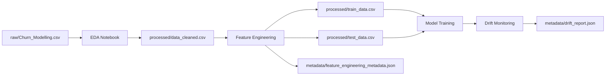

# Carpeta: Data

## 1. Propósito

Esta carpeta contiene **todos los datos del proyecto**, organizados en tres subcarpetas principales:
- `raw/` - Datos originales sin procesar
- `processed/` - Datos procesados y listos para modelado
- `metadata/` - Metadatos y reportes del pipeline

---

## 2. Estructura de la Carpeta

```
data/
├── raw/                          # Datos originales
│   └── Churn_Modelling.csv       # Dataset original del proyecto
├── processed/                    # Datos procesados
│   ├── data_cleaned.csv          # Dataset limpio post-EDA
│   ├── train_data.csv            # Datos de entrenamiento transformados
│   └── test_data.csv             # Datos de prueba transformados
└── metadata/                     # Metadatos y reportes
    ├── eda_metadata.json         # Metadatos del análisis exploratorio
    ├── feature_engineering_metadata.json  # Metadatos del feature engineering
    ├── drift_report.json         # Reporte de data drift
    └── training_results.json     # Resultados del entrenamiento (opcional)
```

---

## 3. Descripción de Archivos

### 3.1. Carpeta `raw/`

| Archivo | Descripción | Tamaño | Generado por |
|:---|:---|:---|:---|
| **Churn_Modelling.csv** | Dataset original de churn bancario | ~1MB | Proporcionado inicialmente |

**Características del dataset original:**
- **Registros:** 10,000 clientes
- **Columnas:** 14 variables
- **Target:** `Exited` (0 = No churn, 1 = Churn)
- **Variables:** CreditScore, Geography, Gender, Age, Tenure, Balance, NumOfProducts, HasCrCard, IsActiveMember, EstimatedSalary

**⚠️ IMPORTANTE:** Este archivo **NO debe modificarse**. Es la fuente de verdad del proyecto.

---

### 3.2. Carpeta `processed/`

#### 3.2.1. `data_cleaned.csv`

**Generado por:** `mlops_pipeline/src/compresion_eda.ipynb`

**Propósito:** Dataset limpio después del análisis exploratorio.

**Transformaciones aplicadas:**
- Eliminación de columnas innecesarias (ej: RowNumber, CustomerId, Surname)
- Tratamiento de valores nulos (si los hubiera)
- Corrección de tipos de datos
- Eliminación de duplicados
- Tratamiento de outliers (según análisis)

**Uso:** Input para el feature engineering.

---

#### 3.2.2. `train_data.csv`

**Generado por:** `mlops_pipeline/src/ft_engineering.py`

**Propósito:** Datos de entrenamiento completamente procesados y transformados.

**Características:**
- **Registros:** ~8,000 (80% del dataset limpio)
- **Columnas:** ~15 (después de one-hot encoding)
- **Transformaciones:**
  - Variables numéricas escaladas (StandardScaler/MinMaxScaler)
  - Variables categóricas encoded (OneHotEncoder)
  - Sin valores nulos
  - Listo para entrenar modelos

**Estructura:**
```
CreditScore, Age, Balance, EstimatedSalary, Tenure, NumOfProducts, 
HasCrCard, IsActiveMember, Geography_Germany, Geography_Spain, 
Gender_Male, Exited
```

**Uso:** Entrenamiento de modelos ML.

---

#### 3.2.3. `test_data.csv`

**Generado por:** `mlops_pipeline/src/ft_engineering.py`

**Propósito:** Datos de prueba para evaluación de modelos.

**Características:**
- **Registros:** ~2,000 (20% del dataset limpio)
- **Columnas:** ~15 (mismas que train_data.csv)
- **Transformaciones:** Idénticas a train_data.csv
- **Split estratificado:** Mantiene proporción de clases

**⚠️ IMPORTANTE:** 
- Nunca usar para entrenamiento
- Usar solo para evaluación final
- No hacer data leakage

**Uso:** Evaluación de modelos en `model_training_evaluation.py`.

---

### 3.3. Carpeta `metadata/`

#### 3.3.1. `eda_metadata.json`

**Generado por:** `mlops_pipeline/src/compresion_eda.ipynb`

**Contenido:**
```json
{
    "timestamp": "2025-11-10T12:00:00",
    "dataset_shape": [10000, 14],
    "target_column": "Exited",
    "numerical_columns": ["CreditScore", "Age", "Balance", ...],
    "categorical_columns": ["Geography", "Gender"],
    "missing_values": {...},
    "outliers_detected": {...},
    "class_distribution": {"0": 7963, "1": 2037}
}
```

**Uso:** 
- Referencia para feature engineering
- Documentación del análisis exploratorio

---

#### 3.3.2. `feature_engineering_metadata.json`

**Generado por:** `mlops_pipeline/src/ft_engineering.py`

**Contenido:**
```json
{
    "timestamp": "2025-11-10T13:00:00",
    "original_shape": [10000, 11],
    "train_shape": [8000, 15],
    "test_shape": [2000, 15],
    "target_column": "Exited",
    "numerical_continuous": ["CreditScore", "Age", "Balance", "EstimatedSalary"],
    "numerical_discrete": ["Tenure", "NumOfProducts", "HasCrCard", "IsActiveMember"],
    "categorical": ["Geography", "Gender"],
    "feature_names": ["CreditScore", "Age", ..., "Geography_Germany", "Gender_Male"],
    "scaling_method": "standard",
    "test_size": 0.2,
    "random_state": 42
}
```

**Uso:**
- Configuración del preprocessor
- Reproducibilidad del pipeline
- Documentación de transformaciones

---

#### 3.3.3. `drift_report.json`

**Generado por:** `mlops_pipeline/src/model_monitoring.py`

**Contenido:**
```json
{
    "timestamp": "2025-11-10T15:30:00",
    "reference_data": {
        "n_samples": 8000,
        "date_range": "2023-01-01 to 2023-12-31"
    },
    "current_data": {
        "n_samples": 2000,
        "date_range": "2024-01-01 to 2024-03-31"
    },
    "numerical_drift": {
        "Age": {
            "ks_statistic": 0.0823,
            "p_value": 0.0012,
            "psi": 0.1456,
            "drift_detected": true
        }
    },
    "categorical_drift": {...},
    "alerts": [...],
    "summary": {
        "total_features_monitored": 13,
        "features_with_drift": 2,
        "high_severity_alerts": 0,
        "moderate_severity_alerts": 1,
        "low_severity_alerts": 1
    }
}
```

**Uso:**
- Monitoreo de data drift
- Dashboard de Streamlit
- Alertas de reentrenamiento

---

## 4. Flujo de Datos



---

## 5. Gestión de Versiones de Datos

### 5.1. ¿Qué archivos versionar en Git?

**✅ SÍ versionar:**
- `raw/Churn_Modelling.csv` (si es pequeño, <5MB)
- `metadata/*.json` (siempre)

**❌ NO versionar:**
- `processed/data_cleaned.csv` (generado, puede ser grande)
- `processed/train_data.csv` (generado)
- `processed/test_data.csv` (generado)

**Configuración en `.gitignore`:**
```gitignore
# Datos procesados (se pueden regenerar)
data/processed/*.csv

# Mantener estructura de carpetas
!data/processed/.gitkeep
```

---

## 6. Reproducibilidad

### 6.1. Regenerar Datos Procesados

Si los archivos de `processed/` se eliminan o corrompen:

```powershell
# Paso 1: Ejecutar EDA
jupyter notebook mlops_pipeline/src/compresion_eda.ipynb

# Paso 2: Ejecutar Feature Engineering
python -m mlops_pipeline.src.ft_engineering

# Resultado: Todos los archivos de processed/ se regeneran
```

### 6.2. Verificar Integridad

```python
import pandas as pd

# Verificar train_data.csv
train = pd.read_csv('data/processed/train_data.csv')
assert train.shape[0] == 8000, "Error: Train data shape incorrecto"
assert 'Exited' in train.columns, "Error: Columna target missing"

# Verificar test_data.csv
test = pd.read_csv('data/processed/test_data.csv')
assert test.shape[0] == 2000, "Error: Test data shape incorrecto"
```

---

## 7. Estadísticas de Datos

### 7.1. Tamaños de Archivos

| Archivo | Tamaño Aproximado | Formato |
|:---|:---|:---|
| `raw/Churn_Modelling.csv` | ~1 MB | CSV |
| `processed/data_cleaned.csv` | ~800 KB | CSV |
| `processed/train_data.csv` | ~650 KB | CSV |
| `processed/test_data.csv` | ~165 KB | CSV |
| `metadata/eda_metadata.json` | ~5 KB | JSON |
| `metadata/feature_engineering_metadata.json` | ~3 KB | JSON |
| `metadata/drift_report.json` | ~10 KB | JSON |

**Total aproximado:** ~2.6 MB

---

## 8. Seguridad y Privacidad

### 8.1. Datos Sensibles

**⚠️ IMPORTANTE:** 
- Este dataset es público y no contiene información sensible real
- En un proyecto real, **nunca** versionar datos con PII (Personally Identifiable Information)
- Usar técnicas de anonimización/pseudonimización

### 8.2. Buenas Prácticas

**Para proyectos en producción:**
1. **Separar datos de código:** Usar almacenamiento externo (S3, Azure Blob, etc.)
2. **Cifrar datos sensibles:** Usar encryption at rest
3. **Control de acceso:** Implementar IAM policies
4. **Auditoría:** Logging de acceso a datos
5. **Backup:** Estrategia de respaldo de datos

---

## 9. Troubleshooting

### Problema: "File not found: Churn_Modelling.csv"
**Solución:** Verificar que el archivo esté en `data/raw/`.

### Problema: "Los archivos en processed/ están vacíos"
**Solución:** Ejecutar el pipeline completo desde el EDA.

### Problema: "drift_report.json no existe"
**Solución:** Ejecutar `python -m mlops_pipeline.src.model_monitoring`.

### Problema: "Datos corruptos o inconsistentes"
**Solución:** 
```powershell
# Eliminar y regenerar
Remove-Item data/processed/*.csv
python -m mlops_pipeline.src.ft_engineering
```

---

## 10. Contacto

Para preguntas sobre la gestión de datos del proyecto, referirse al README principal.

**Documentación relacionada:**
- [README EDA](../docs/README_EDA.md)
- [README Feature Engineering](../docs/README_FEATURE_ENGINEERING.md)
- [README Monitoring](../docs/README_MONITORING.md)
