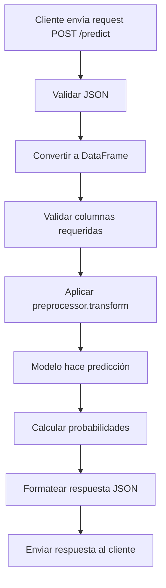

# Módulo: Despliegue del Modelo (Deployment)

## 1. Propósito

Este módulo implementa una **API REST con Flask** para servir predicciones del modelo entrenado en producción. Incluye:
- API REST con múltiples endpoints
- Carga automática de modelo y preprocessor
- Validación de datos de entrada
- Predicciones individuales y por lotes
- Health checks
- Manejo de errores robusto
- CORS habilitado para integración con frontend
- Logging completo

---

## 2. Instrucciones de Ejecución

### 2.1. Prerrequisitos
```powershell
# Activar entorno virtual
.\Proyecto-venv\Scripts\Activate.ps1

# Verificar que los artefactos del modelo existan:
# - models/best_model.pkl
# - models/preprocessor.pkl
# - models/model_metadata.json
# - data/metadata/feature_engineering_metadata.json
```

### 2.2. Iniciar el Servidor de la API

**Método 1: Ejecución directa**
```powershell
# Iniciar servidor Flask
python -m mlops_pipeline.src.model_deploy

# La API estará disponible en: http://localhost:5000
```

**Método 2: Con variables de entorno**
```powershell
# Configurar puerto y modo debug
$env:FLASK_APP="mlops_pipeline.src.model_deploy"
$env:FLASK_ENV="development"  # o "production"
$env:PORT="8080"

# Iniciar servidor
flask run --host=0.0.0.0 --port=8080
```

**Método 3: Con Docker**
```powershell
# Construir imagen Docker
docker build -f docker/Dockerfile -t mlops-api:latest .

# Ejecutar contenedor
docker run -p 5000:5000 mlops-api:latest
```

### 2.3. Verificar que la API Funciona

```powershell
# Test con curl
curl http://localhost:5000/

# Test con PowerShell
Invoke-RestMethod -Uri "http://localhost:5000/" -Method Get

# Respuesta esperada:
# {
#   "status": "ok",
#   "message": "MLOps API is running",
#   "model_loaded": true
# }
```

---

## 3. Mapeo de Requisitos del Checklist

| Requisito del Checklist | Archivo | Función/Línea (Aprox.) | Descripción |
|:---|:---|:---|:---|
| **¿Se crea una API REST?** | `model_deploy.py` | Flask app (línea ~30) | API completa con Flask |
| **¿Existe endpoint /predict?** | `model_deploy.py` | `@app.route('/predict')` (línea ~145) | Endpoint principal de predicción |
| **¿Se cargan artefactos del modelo?** | `model_deploy.py` | `load_artifacts()` (línea ~41) | Carga de modelo + preprocessor + metadata |
| **¿Se validan datos de entrada?** | `model_deploy.py` | `validate_input_data()` (línea ~82) | Validación de schema y tipos |
| **¿Se proporciona health check?** | `model_deploy.py` | `@app.route('/')` (línea ~119) | Endpoint GET / para health |
| **¿Se maneja CORS?** | `model_deploy.py` | `CORS(app)` (línea ~30) | Habilitación de CORS |
| **¿Se usa logging?** | `model_deploy.py` | Setup logging (línea ~23) | Logging completo de requests |
| **¿Se maneja preprocessing en inferencia?** | `model_deploy.py` | Dentro de `/predict` (línea ~169) | Aplicación del preprocessor |
| **¿Se devuelven probabilidades?** | `model_deploy.py` | `/predict` response (línea ~182) | Clases y probabilidades |
| **¿Existe endpoint de información del modelo?** | `model_deploy.py` | `@app.route('/model-info')` (línea ~203) | Metadatos del modelo |
| **¿Se maneja manejo de errores?** | `model_deploy.py` | Try-except blocks (múltiples ubicaciones) | Error handling robusto |
| **¿Existe interfaz web?** | `frontend/index.html` | Frontend HTML+JS | Interfaz de usuario |
| **¿Hay Dockerfile?** | `docker/Dockerfile` | Dockerfile completo | Containerización |

---

## 4. Arquitectura de la API

### 4.1. Endpoints Disponibles

```
GET  /                  # Health check
POST /predict           # Predicción de churn
GET  /model-info        # Información del modelo
```

### 4.2. Flujo de Predicción



---

## 5. Endpoints Detallados

### 5.1. Health Check: `GET /`

**Propósito:** Verificar que la API está funcionando y el modelo está cargado.

**Request:**
```http
GET http://localhost:5000/
```

**Response (200 OK):**
```json
{
    "status": "ok",
    "message": "MLOps API is running",
    "model_loaded": true,
    "version": "1.0.0"
}
```

**Uso en producción:**
- Kubernetes liveness probe
- Health checks de load balancers
- Monitoreo de uptime

---

### 5.2. Predicción: `POST /predict`

**Propósito:** Realizar predicción de churn para uno o múltiples clientes.

**Request (Predicción Individual):**
```http
POST http://localhost:5000/predict
Content-Type: application/json

{
    "CreditScore": 619,
    "Geography": "France",
    "Gender": "Female",
    "Age": 42,
    "Tenure": 2,
    "Balance": 0.0,
    "NumOfProducts": 1,
    "HasCrCard": 1,
    "IsActiveMember": 1,
    "EstimatedSalary": 101348.88
}
```

**Request (Predicción por Lotes):**
```http
POST http://localhost:5000/predict
Content-Type: application/json

[
    {
        "CreditScore": 619,
        "Geography": "France",
        "Gender": "Female",
        "Age": 42,
        "Tenure": 2,
        "Balance": 0.0,
        "NumOfProducts": 1,
        "HasCrCard": 1,
        "IsActiveMember": 1,
        "EstimatedSalary": 101348.88
    },
    {
        "CreditScore": 502,
        "Geography": "Spain",
        "Gender": "Male",
        "Age": 35,
        "Tenure": 5,
        "Balance": 125000.0,
        "NumOfProducts": 2,
        "HasCrCard": 1,
        "IsActiveMember": 0,
        "EstimatedSalary": 79084.10
    }
]
```

**Response (200 OK):**
```json
{
    "predictions": [1, 0],
    "probabilities": [
        [0.2456, 0.7544],
        [0.8234, 0.1766]
    ],
    "model_name": "Random Forest",
    "timestamp": "2025-11-10T16:45:30"
}
```

**Interpretación:**
- `predictions`: Clases predichas (0 = No churn, 1 = Churn)
- `probabilities`: [P(No churn), P(Churn)] para cada cliente
- `model_name`: Nombre del modelo usado
- `timestamp`: Timestamp de la predicción

**Errores Comunes:**

**400 Bad Request - Faltan columnas:**
```json
{
    "error": "Missing required columns: ['Age', 'Balance']"
}
```

**400 Bad Request - Tipos incorrectos:**
```json
{
    "error": "Invalid data types in columns: Age must be numeric"
}
```

**500 Internal Server Error:**
```json
{
    "error": "Prediction failed: [mensaje de error]"
}
```

---

### 5.3. Información del Modelo: `GET /model-info`

**Propósito:** Obtener metadatos del modelo desplegado.

**Request:**
```http
GET http://localhost:5000/model-info
```

**Response (200 OK):**
```json
{
    "model_name": "Random Forest",
    "model_type": "RandomForestClassifier",
    "trained_at": "2025-11-10T14:30:00",
    "metrics": {
        "accuracy": 0.8650,
        "precision": 0.7234,
        "recall": 0.4893,
        "f1": 0.5834,
        "roc_auc": 0.8521
    },
    "hyperparameters": {
        "n_estimators": 100,
        "max_depth": 10,
        "random_state": 42
    },
    "features": [
        "CreditScore", "Geography", "Gender", "Age",
        "Tenure", "Balance", "NumOfProducts",
        "HasCrCard", "IsActiveMember", "EstimatedSalary"
    ],
    "api_version": "1.0.0"
}
```

---

## 6. Funciones Clave del Código

### 6.1. Carga de Artefactos

```python
def load_artifacts() -> None:
    """
    Carga el modelo entrenado, preprocessor y metadatos.
    
    Se ejecuta al iniciar la aplicación.
    Variables globales: MODEL, PREPROCESSOR, FEATURE_NAMES, MODEL_METADATA
    """
    global MODEL, PREPROCESSOR, FEATURE_NAMES, MODEL_METADATA
    
    # Cargar modelo
    MODEL = joblib.load('models/best_model.pkl')
    
    # Cargar preprocessor
    PREPROCESSOR = joblib.load('models/preprocessor.pkl')
    
    # Cargar metadatos
    with open('models/model_metadata.json', 'r') as f:
        MODEL_METADATA = json.load(f)
    
    logger.info("Artefactos cargados exitosamente")
```

**Ubicación:** Línea ~41

---

### 6.2. Validación de Entrada

```python
def validate_input_data(data: Union[Dict, List[Dict]]) -> pd.DataFrame:
    """
    Valida y convierte los datos de entrada a DataFrame.
    
    Args:
        data: Datos de entrada (dict o lista de dicts)
    
    Returns:
        DataFrame validado
    
    Raises:
        ValueError: Si los datos son inválidos
    """
    # Convertir a lista si es un solo registro
    if isinstance(data, dict):
        data = [data]
    
    # Crear DataFrame
    df = pd.DataFrame(data)
    
    # Validar columnas requeridas
    missing_cols = set(FEATURE_NAMES) - set(df.columns)
    if missing_cols:
        raise ValueError(f"Missing required columns: {list(missing_cols)}")
    
    # Validar tipos de datos
    # ... (código de validación)
    
    return df
```

**Ubicación:** Línea ~82

---

### 6.3. Endpoint de Predicción

```python
@app.route('/predict', methods=['POST'])
def predict():
    """
    Endpoint para realizar predicciones.
    
    Request Body:
        JSON con las features del cliente (individual o batch)
    
    Returns:
        JSON con predicciones y probabilidades
    """
    try:
        # Obtener datos del request
        data = request.get_json()
        
        # Validar entrada
        df = validate_input_data(data)
        
        # Asegurar orden correcto de columnas
        df = df[FEATURE_NAMES]
        
        # Aplicar preprocessor
        X_transformed = PREPROCESSOR.transform(df)
        
        # Hacer predicción
        predictions = MODEL.predict(X_transformed)
        probabilities = MODEL.predict_proba(X_transformed)
        
        # Formatear respuesta
        response = {
            'predictions': predictions.tolist(),
            'probabilities': probabilities.tolist(),
            'model_name': MODEL_METADATA.get('model_name', 'Unknown'),
            'timestamp': datetime.now().isoformat()
        }
        
        return jsonify(response), 200
        
    except Exception as e:
        logger.error(f"Prediction error: {e}")
        return jsonify({'error': str(e)}), 500
```

**Ubicación:** Línea ~145

---

## 7. Integración con Frontend

### 7.1. Frontend HTML + JavaScript

El frontend se encuentra en `frontend/index.html` y proporciona:
- Formulario web para ingresar datos del cliente
- Validación de campos en el navegador
- Llamada AJAX a la API `/predict`
- Visualización de resultados

**Iniciar frontend:**
```powershell
# Método 1: Servidor Python simple
cd frontend
python server.py

# Acceder en: http://localhost:3000

# Método 2: Usando script batch
.\frontend\start.bat
```

### 7.2. Ejemplo de Llamada desde JavaScript

```javascript
async function predictChurn() {
    const customerData = {
        CreditScore: parseInt(document.getElementById('creditScore').value),
        Geography: document.getElementById('geography').value,
        Gender: document.getElementById('gender').value,
        Age: parseInt(document.getElementById('age').value),
        Tenure: parseInt(document.getElementById('tenure').value),
        Balance: parseFloat(document.getElementById('balance').value),
        NumOfProducts: parseInt(document.getElementById('numProducts').value),
        HasCrCard: parseInt(document.getElementById('hasCrCard').value),
        IsActiveMember: parseInt(document.getElementById('isActive').value),
        EstimatedSalary: parseFloat(document.getElementById('salary').value)
    };
    
    try {
        const response = await fetch('http://localhost:5000/predict', {
            method: 'POST',
            headers: {
                'Content-Type': 'application/json'
            },
            body: JSON.stringify(customerData)
        });
        
        const result = await response.json();
        
        // Mostrar resultado
        displayResult(result);
    } catch (error) {
        console.error('Error:', error);
        alert('Error al hacer la predicción');
    }
}
```

---

## 8. Despliegue con Docker

### 8.1. Dockerfile

El archivo `docker/Dockerfile` contiene:

```dockerfile
FROM python:3.10-slim

WORKDIR /app

# Copiar requirements
COPY requirements.txt .
RUN pip install --no-cache-dir -r requirements.txt

# Copiar código fuente
COPY mlops_pipeline/ ./mlops_pipeline/
COPY models/ ./models/
COPY data/metadata/ ./data/metadata/

# Exponer puerto
EXPOSE 5000

# Comando de inicio
CMD ["python", "-m", "mlops_pipeline.src.model_deploy"]
```

### 8.2. Construcción y Ejecución

```powershell
# Construir imagen
docker build -f docker/Dockerfile -t mlops-api:latest .

# Ejecutar contenedor
docker run -d -p 5000:5000 --name mlops-api mlops-api:latest

# Ver logs
docker logs -f mlops-api

# Detener contenedor
docker stop mlops-api
docker rm mlops-api
```

### 8.3. Docker Compose

```powershell
# Iniciar todos los servicios (API + Dashboard + Frontend)
docker-compose -f docker/docker-compose.yml up -d

# Ver logs
docker-compose -f docker/docker-compose.yml logs -f

# Detener servicios
docker-compose -f docker/docker-compose.yml down
```

---

## 9. Testing de la API

### 9.1. Tests con cURL

```bash
# Health check
curl http://localhost:5000/

# Predicción individual
curl -X POST http://localhost:5000/predict \
  -H "Content-Type: application/json" \
  -d '{
    "CreditScore": 619,
    "Geography": "France",
    "Gender": "Female",
    "Age": 42,
    "Tenure": 2,
    "Balance": 0.0,
    "NumOfProducts": 1,
    "HasCrCard": 1,
    "IsActiveMember": 1,
    "EstimatedSalary": 101348.88
  }'

# Información del modelo
curl http://localhost:5000/model-info
```

### 9.2. Tests con Python (Requests)

```python
import requests

# Health check
response = requests.get('http://localhost:5000/')
print(response.json())

# Predicción
customer_data = {
    "CreditScore": 619,
    "Geography": "France",
    "Gender": "Female",
    "Age": 42,
    "Tenure": 2,
    "Balance": 0.0,
    "NumOfProducts": 1,
    "HasCrCard": 1,
    "IsActiveMember": 1,
    "EstimatedSalary": 101348.88
}

response = requests.post(
    'http://localhost:5000/predict',
    json=customer_data
)
print(response.json())
```

### 9.3. Tests Automatizados

El archivo `frontend/test_frontend.py` contiene tests automatizados:

```powershell
# Ejecutar tests
python frontend/test_frontend.py
```

---

## 10. Configuración de Producción

### 10.1. Variables de Entorno

```powershell
# Configuración recomendada para producción
$env:FLASK_ENV="production"
$env:PORT="8080"
$env:LOG_LEVEL="INFO"
$env:MODEL_PATH="models/best_model.pkl"
$env:PREPROCESSOR_PATH="models/preprocessor.pkl"
```

### 10.2. Uso de Gunicorn (Linux/Mac)

```bash
# Instalar Gunicorn
pip install gunicorn

# Ejecutar con Gunicorn (producción)
gunicorn -w 4 -b 0.0.0.0:8080 mlops_pipeline.src.model_deploy:app

# -w 4: 4 workers
# -b 0.0.0.0:8080: Bind a todas las interfaces en puerto 8080
```

### 10.3. Consideraciones de Seguridad

**Recomendaciones:**
1. **Autenticación:** Agregar API keys o JWT tokens
2. **Rate limiting:** Limitar requests por IP
3. **HTTPS:** Usar certificados SSL/TLS
4. **Input sanitization:** Validar y sanitizar todas las entradas
5. **Logging:** Registrar todas las requests para auditoría

---

## 11. Monitoreo en Producción

### 11.1. Métricas a Monitorear

- **Latencia:** Tiempo de respuesta de `/predict`
- **Throughput:** Requests por segundo
- **Error rate:** Porcentaje de requests con error
- **Model drift:** Distribución de predicciones
- **Resource usage:** CPU, memoria, disco

### 11.2. Integración con Prometheus

```python
# Agregar métricas de Prometheus
from prometheus_client import Counter, Histogram, generate_latest

# Contadores
predictions_total = Counter('predictions_total', 'Total predictions made')
errors_total = Counter('errors_total', 'Total errors')

# Histogramas
prediction_duration = Histogram('prediction_duration_seconds', 'Prediction duration')

@app.route('/predict', methods=['POST'])
@prediction_duration.time()
def predict():
    predictions_total.inc()
    # ... código de predicción ...

@app.route('/metrics')
def metrics():
    return generate_latest()
```

---

## 12. Próximos Pasos

Después de desplegar la API:
1. **Monitorear con Streamlit:** `streamlit run mlops_pipeline/src/streamlit_app.py`
2. **Integrar con frontend:** Usar la interfaz web
3. **Configurar CI/CD:** Automatizar despliegues
4. **Escalar:** Usar Kubernetes para orquestación

---

## 13. Troubleshooting

### Problema: "FileNotFoundError: best_model.pkl no encontrado"
**Solución:** Entrenar el modelo primero con `model_training_evaluation.py`.

### Problema: "Address already in use" al iniciar Flask
**Solución:** Cambiar el puerto o matar el proceso:
```powershell
# Encontrar proceso usando el puerto 5000
netstat -ano | findstr :5000

# Matar proceso (reemplazar PID)
taskkill /PID <PID> /F
```

### Problema: "CORS error" desde frontend
**Solución:** Verificar que CORS esté habilitado en `model_deploy.py`.

---

**Contacto:**  
Para preguntas sobre este módulo, referirse al README principal del proyecto.
