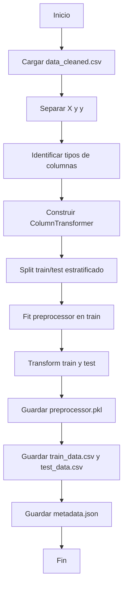

# Módulo: Ingeniería de Características (Feature Engineering)

## 1. Propósito

Este módulo se encarga de la **ingeniería de características** utilizando sklearn pipelines de forma genérica y reutilizable. Incluye:
- Carga del dataset limpio desde el EDA
- Identificación automática de tipos de columnas (numéricas continuas, discretas, categóricas)
- Construcción de pipelines de transformación con `ColumnTransformer`
- Aplicación de transformaciones (escalado, encoding, imputación)
- Split train/test estratificado
- Exportación de datasets procesados
- Guardado del preprocessor para producción

---

## 2. Instrucciones de Ejecución

### 2.1. Prerrequisitos
```powershell
# Activar entorno virtual
.\Proyecto-venv\Scripts\Activate.ps1

# Verificar que el EDA se haya completado
# Debe existir: data/processed/data_cleaned.csv
```

### 2.2. Ejecución del Script

**Método 1: Como módulo Python (Recomendado)**
```powershell
# Ejecutar desde la raíz del proyecto
python -m mlops_pipeline.src.ft_engineering
```

**Método 2: Ejecución directa**
```powershell
# Navegar a la carpeta del script
cd mlops_pipeline\src

# Ejecutar el script
python ft_engineering.py

# Regresar a la raíz
cd ..\..
```

### 2.3. Salidas Esperadas

El script generará:
```
data/processed/
├── train_data.csv          # Dataset de entrenamiento procesado
└── test_data.csv           # Dataset de prueba procesado

models/
└── preprocessor.pkl        # Pipeline de transformación serializado

data/metadata/
└── feature_engineering_metadata.json  # Metadatos del procesamiento
```

**Mensaje de éxito esperado:**
```
INFO - FeatureEngineer inicializado correctamente
INFO - Dataset cargado: 10000 filas, 14 columnas
INFO - Columnas identificadas - Continuas: X, Discretas: Y, Categóricas: Z
INFO - Preprocessor construido correctamente
INFO - Train/Test split: 8000/2000
INFO - Datos transformados - Train: (8000, N), Test: (2000, N)
INFO - Pipeline guardado en: models/preprocessor.pkl
INFO - Feature Engineering completado exitosamente
```

---

## 3. Mapeo de Requisitos del Checklist

| Requisito del Checklist | Archivo | Función/Línea (Aprox.) | Descripción |
|:---|:---|:---|:---|
| **¿Se usa ColumnTransformer?** | `ft_engineering.py` | `build_preprocessor()` (línea ~157) | Construcción del transformador de columnas |
| **¿Se aplican pipelines de sklearn?** | `ft_engineering.py` | `build_preprocessor()` (línea ~157-210) | Pipelines para cada tipo de variable |
| **¿Se identifican tipos de variables?** | `ft_engineering.py` | `identify_column_types()` (línea ~124) | Clasificación automática de columnas |
| **¿Se procesan variables numéricas continuas?** | `ft_engineering.py` | Pipeline `num_continuous` (línea ~168-177) | SimpleImputer + StandardScaler/MinMaxScaler |
| **¿Se procesan variables numéricas discretas?** | `ft_engineering.py` | Pipeline `num_discrete` (línea ~180-189) | SimpleImputer + StandardScaler/MinMaxScaler |
| **¿Se procesan variables categóricas?** | `ft_engineering.py` | Pipeline `cat` (línea ~192-201) | SimpleImputer + OneHotEncoder |
| **¿Se usa SimpleImputer para valores nulos?** | `ft_engineering.py` | Dentro de cada pipeline (líneas ~169, ~181, ~193) | Imputación por mediana/moda |
| **¿Se usa StandardScaler o MinMaxScaler?** | `ft_engineering.py` | `build_preprocessor()` (línea ~174, ~186) | Escalado según parámetro `scaling_method` |
| **¿Se usa OneHotEncoder?** | `ft_engineering.py` | Pipeline categórico (línea ~194) | Encoding de variables categóricas |
| **¿Se guarda el preprocessor?** | `ft_engineering.py` | `save_preprocessor()` (línea ~243) | Serialización con joblib a `models/preprocessor.pkl` |
| **¿Se hace train/test split?** | `ft_engineering.py` | `split_train_test()` (línea ~213) | Split estratificado 80/20 |
| **¿Se usa stratify para balanceo?** | `ft_engineering.py` | `split_train_test()` (línea ~231) | `stratify=y` en train_test_split |
| **¿Se exportan train_data.csv y test_data.csv?** | `ft_engineering.py` | `save_processed_data()` (línea ~267) | Exportación a `data/processed/` |
| **¿Se documentan los metadatos?** | `ft_engineering.py` | `save_metadata()` (línea ~297) | JSON con configuración del pipeline |
| **¿Se mantienen nombres de features?** | `ft_engineering.py` | `get_feature_names()` (línea ~320) | Extracción de nombres post-transformación |
| **¿El código es reutilizable?** | `ft_engineering.py` | Clase `FeatureEngineer` | Diseño genérico, no hardcodeado |

---

## 4. Arquitectura del Módulo

### 4.1. Clase Principal: `FeatureEngineer`

```python
class FeatureEngineer:
    def __init__(self, project_root: Path)
    def load_data(self) -> pd.DataFrame
    def split_features_target(self, df: pd.DataFrame) -> Tuple[pd.DataFrame, pd.Series]
    def identify_column_types(self, X: pd.DataFrame) -> Tuple[List[str], List[str], List[str]]
    def build_preprocessor(self, ...) -> ColumnTransformer
    def split_train_test(self, X: pd.DataFrame, y: pd.Series) -> Tuple[...]
    def save_preprocessor(self, preprocessor: ColumnTransformer) -> None
    def save_processed_data(self, ...) -> None
    def save_metadata(self, ...) -> None
    def get_feature_names(self, preprocessor: ColumnTransformer) -> List[str]
    def run_pipeline(self) -> None
```

### 4.2. Flujo de Ejecución



---

## 5. Pipelines de Transformación

### 5.1. Pipeline para Variables Numéricas Continuas

```python
numerical_continuous_pipeline = Pipeline([
    ('imputer', SimpleImputer(strategy='median')),
    ('scaler', StandardScaler())  # o MinMaxScaler()
])
```

**Columnas típicas:** `CreditScore`, `Age`, `Balance`, `EstimatedSalary`

### 5.2. Pipeline para Variables Numéricas Discretas

```python
numerical_discrete_pipeline = Pipeline([
    ('imputer', SimpleImputer(strategy='most_frequent')),
    ('scaler', StandardScaler())  # o MinMaxScaler()
])
```

**Columnas típicas:** `Tenure`, `NumOfProducts`, `HasCrCard`, `IsActiveMember`

### 5.3. Pipeline para Variables Categóricas

```python
categorical_pipeline = Pipeline([
    ('imputer', SimpleImputer(strategy='most_frequent')),
    ('encoder', OneHotEncoder(drop='first', sparse_output=False, handle_unknown='ignore'))
])
```

**Columnas típicas:** `Geography`, `Gender`

### 5.4. ColumnTransformer Final

```python
preprocessor = ColumnTransformer(
    transformers=[
        ('num_continuous', numerical_continuous_pipeline, numerical_continuous),
        ('num_discrete', numerical_discrete_pipeline, numerical_discrete),
        ('cat', categorical_pipeline, categorical)
    ],
    remainder='drop'
)
```

---

## 6. Configuración y Parámetros

### 6.1. Parámetros Configurables

| Parámetro | Ubicación | Valores | Default | Descripción |
|:---|:---|:---|:---|:---|
| `target_column` | Línea ~60 | String | `'Exited'` | Nombre de la variable objetivo |
| `test_size` | Línea ~231 | Float (0-1) | `0.2` | Proporción para test split |
| `random_state` | Línea ~231 | Int | `42` | Semilla para reproducibilidad |
| `scaling_method` | Línea ~157 | `'standard'` o `'minmax'` | `'standard'` | Método de escalado |
| `stratify` | Línea ~231 | Bool | `True` | Estratificación en split |

### 6.2. Modificar Configuración

Para cambiar parámetros, editar el método `run_pipeline()` en `ft_engineering.py`:

```python
def run_pipeline(self) -> None:
    # Cambiar aquí los parámetros
    X_train, X_test, y_train, y_test = self.split_train_test(
        X, y,
        test_size=0.3,        # Cambiar proporción
        random_state=123      # Cambiar semilla
    )
```

---

## 7. Metadatos Generados

El archivo `feature_engineering_metadata.json` contiene:

```json
{
    "timestamp": "2025-11-10T12:30:00",
    "original_shape": [10000, 14],
    "train_shape": [8000, 15],
    "test_shape": [2000, 15],
    "target_column": "Exited",
    "numerical_continuous": ["CreditScore", "Age", "Balance", "EstimatedSalary"],
    "numerical_discrete": ["Tenure", "NumOfProducts", "HasCrCard", "IsActiveMember"],
    "categorical": ["Geography", "Gender"],
    "feature_names": ["CreditScore", "Age", ..., "Geography_Germany", "Gender_Male"],
    "scaling_method": "standard",
    "test_size": 0.2,
    "random_state": 42
}
```

---

## 8. Reutilización del Preprocessor

### 8.1. Cargar Preprocessor en Producción

```python
import joblib

# Cargar el preprocessor
preprocessor = joblib.load('models/preprocessor.pkl')

# Transformar nuevos datos
new_data_transformed = preprocessor.transform(new_data)
```

### 8.2. Uso en Deployment

El preprocessor se carga automáticamente en:
- `model_deploy.py` (API Flask)
- Cualquier script de inferencia

---

## 9. Validaciones y Checks

### 9.1. Verificaciones Automáticas

El script verifica:
- ✅ Existencia de `data_cleaned.csv`
- ✅ Presencia de la columna objetivo
- ✅ Al menos una columna de cada tipo
- ✅ Shapes correctos post-transformación
- ✅ Sin valores nulos en datos transformados

### 9.2. Mensajes de Error Comunes

**Error:** `FileNotFoundError: data_cleaned.csv no encontrado`
- **Causa:** EDA no completado
- **Solución:** Ejecutar `compresion_eda.ipynb` primero

**Error:** `ValueError: Columna objetivo 'Exited' no encontrada`
- **Causa:** Dataset incorrecto o columna renombrada
- **Solución:** Verificar nombre de columna objetivo

---

## 10. Ventajas del Diseño

### 10.1. Modularidad
- Clase reutilizable para cualquier dataset tabular
- No hardcodeado a un dataset específico

### 10.2. Reproducibilidad
- Uso de `random_state` fijo
- Serialización del preprocessor completo

### 10.3. Escalabilidad
- Compatible con scikit-learn pipelines
- Fácil agregar nuevas transformaciones

### 10.4. Mantenibilidad
- Código bien documentado
- Logging detallado
- Type hints en todas las funciones

---

## 11. Próximos Pasos

Después de completar el Feature Engineering, continuar con:
1. **Entrenamiento de Modelos** → `python -m mlops_pipeline.src.model_training_evaluation`
2. Uso de `train_data.csv` y `test_data.csv`
3. Carga automática del `preprocessor.pkl`

---

## 12. Troubleshooting

### Problema: "Shape mismatch después de transformación"
**Solución:** Verificar que todas las columnas se procesen correctamente.

### Problema: "UserWarning: Columns with only zeros"
**Solución:** Normal para variables categóricas con OneHotEncoder.

### Problema: "MemoryError en la transformación"
**Solución:** Reducir tamaño del dataset o usar sparse matrices.

---

**Contacto:**  
Para preguntas sobre este módulo, referirse al README principal del proyecto.
