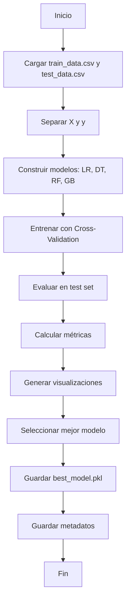

# Módulo: Entrenamiento y Evaluación de Modelos

## 1. Propósito

Este módulo implementa el **entrenamiento, evaluación y selección de modelos de Machine Learning** de forma genérica y reutilizable. Incluye:
- Entrenamiento de múltiples modelos supervisados
- Validación cruzada (Cross-Validation)
- Evaluación con múltiples métricas de clasificación
- Comparación de modelos
- Visualización de resultados (ROC curves, Confusion Matrix)
- Selección y guardado del mejor modelo
- Generación de reportes

---

## 2. Instrucciones de Ejecución

### 2.1. Prerrequisitos
```powershell
# Activar entorno virtual
.\Proyecto-venv\Scripts\Activate.ps1

# Verificar que el Feature Engineering se haya completado
# Deben existir:
# - data/processed/train_data.csv
# - data/processed/test_data.csv
# - models/preprocessor.pkl
```

### 2.2. Ejecución del Script

**Método 1: Como módulo Python (Recomendado)**
```powershell
# Ejecutar desde la raíz del proyecto
python -m mlops_pipeline.src.model_training_evaluation
```

**Método 2: Ejecución directa**
```powershell
# Navegar a la carpeta del script
cd mlops_pipeline\src

# Ejecutar el script
python model_training_evaluation.py

# Regresar a la raíz
cd ..\..
```

### 2.3. Salidas Esperadas

El script generará:
```
models/
├── best_model.pkl                  # Mejor modelo entrenado
├── model_metadata.json             # Metadatos del modelo
└── preprocessor.pkl                # Ya existente

reports/plots/
├── roc_curves.png                  # Curvas ROC de todos los modelos
├── confusion_matrix_*.png          # Matrices de confusión individuales
└── model_comparison.png            # Comparación de métricas

data/metadata/
└── training_results.json           # Resultados detallados del entrenamiento
```

**Tiempo estimado de ejecución:** 3-10 minutos (depende del hardware)

---

## 3. Mapeo de Requisitos del Checklist

| Requisito del Checklist | Archivo | Función/Línea (Aprox.) | Descripción |
|:---|:---|:---|:---|
| **¿Se entrenan múltiples modelos supervisados?** | `model_training_evaluation.py` | `build_models()` (línea ~122) | 4 modelos: LR, DT, RF, GB |
| **¿Se utiliza una función `build_model()`?** | `model_training_evaluation.py` | `build_models()` (línea ~122) | Construcción de diccionario de modelos |
| **¿Se aplican técnicas de validación (cross-validation)?** | `model_training_evaluation.py` | `train_with_cross_validation()` (línea ~159) | StratifiedKFold con 5 folds |
| **¿Se calcula cross-validation score?** | `model_training_evaluation.py` | `train_with_cross_validation()` (línea ~177) | `cross_val_score()` con múltiples métricas |
| **¿Se evalúan modelos en test set?** | `model_training_evaluation.py` | `evaluate_model()` (línea ~202) | Predicciones en datos de prueba |
| **¿Se calculan múltiples métricas?** | `model_training_evaluation.py` | `evaluate_model()` (línea ~202) | Accuracy, Precision, Recall, F1, ROC-AUC |
| **¿Se usa la función `summarize_classification()`?** | `model_training_evaluation.py` | `summarize_classification()` (línea ~256) | Resumen en DataFrame |
| **¿Se comparan modelos?** | `model_training_evaluation.py` | `select_best_model()` (línea ~282) | Comparación por F1-score |
| **¿Se generan curvas ROC?** | `model_training_evaluation.py` | `plot_roc_curves()` (línea ~393) | ROC curves con AUC |
| **¿Se generan matrices de confusión?** | `model_training_evaluation.py` | `plot_confusion_matrices()` (línea ~444) | Confusion matrix para cada modelo |
| **¿Se guarda el objeto del modelo seleccionado?** | `model_training_evaluation.py` | `save_best_model()` (línea ~360) | Serialización con joblib |
| **¿Se justifica la selección del modelo final?** | `model_training_evaluation.py` | `select_best_model()` (línea ~282) + logs | Criterio: F1-score máximo |
| **¿Se genera classification_report?** | `model_training_evaluation.py` | `evaluate_model()` (línea ~243) | Reporte sklearn |
| **¿Se guardan metadatos del modelo?** | `model_training_evaluation.py` | `save_best_model()` (línea ~360) | JSON con métricas y configuración |

---

## 4. Arquitectura del Módulo

### 4.1. Clase Principal: `ModelTrainer`

```python
class ModelTrainer:
    def __init__(self, project_root: Path)
    def load_data(self) -> Tuple[pd.DataFrame, pd.DataFrame]
    def split_features_target(self, ...) -> Tuple[np.ndarray, ...]
    def build_models(self) -> Dict[str, Any]
    def train_with_cross_validation(self, ...) -> Dict[str, float]
    def evaluate_model(self, ...) -> Dict[str, float]
    def summarize_classification(self, ...) -> pd.DataFrame
    def select_best_model(self, ...) -> Tuple[str, Any]
    def save_best_model(self, ...) -> None
    def plot_roc_curves(self, ...) -> None
    def plot_confusion_matrices(self, ...) -> None
    def run_training_pipeline(self) -> None
```

### 4.2. Flujo de Ejecución



---

## 5. Modelos Implementados

### 5.1. Logistic Regression
```python
LogisticRegression(
    max_iter=1000,
    random_state=42,
    n_jobs=-1
)
```
- **Ventajas:** Rápido, interpretable, buena baseline
- **Desventajas:** Asume linealidad

### 5.2. Decision Tree
```python
DecisionTreeClassifier(
    max_depth=10,
    min_samples_split=20,
    random_state=42
)
```
- **Ventajas:** No lineal, interpretable, maneja interacciones
- **Desventajas:** Propenso a overfitting

### 5.3. Random Forest
```python
RandomForestClassifier(
    n_estimators=100,
    max_depth=10,
    min_samples_split=20,
    random_state=42,
    n_jobs=-1
)
```
- **Ventajas:** Robusto, maneja no linealidad, reduce overfitting
- **Desventajas:** Menos interpretable

### 5.4. Gradient Boosting
```python
GradientBoostingClassifier(
    n_estimators=100,
    max_depth=5,
    learning_rate=0.1,
    random_state=42
)
```
- **Ventajas:** Alto rendimiento, maneja complejidad
- **Desventajas:** Más lento, requiere tuning

---

## 6. Métricas de Evaluación

### 6.1. Métricas Calculadas

| Métrica | Fórmula | Interpretación |
|:---|:---|:---|
| **Accuracy** | (TP + TN) / Total | Proporción de predicciones correctas |
| **Precision** | TP / (TP + FP) | De los predichos como positivos, cuántos lo son |
| **Recall** | TP / (TP + FN) | De los positivos reales, cuántos se detectan |
| **F1-Score** | 2 * (Precision * Recall) / (Precision + Recall) | Media armónica de Precision y Recall |
| **ROC-AUC** | Área bajo curva ROC | Capacidad de discriminación del modelo |

### 6.2. Validación Cruzada

```python
StratifiedKFold(n_splits=5, shuffle=True, random_state=42)
```

**Métricas de CV calculadas:**
- Accuracy promedio (5 folds)
- Desviación estándar del accuracy
- Permite evaluar estabilidad del modelo

---

## 7. Criterio de Selección del Mejor Modelo

### 7.1. Criterio Principal: F1-Score

El **F1-Score** se utiliza como métrica principal porque:
1. **Balance entre Precision y Recall:** Importante en datasets desbalanceados
2. **Penaliza falsos positivos y falsos negativos:** Ambos son costosos en churn
3. **Métrica estándar en clasificación binaria desbalanceada**

### 7.2. Función de Selección

```python
def select_best_model(
    self,
    results: Dict[str, Dict[str, float]],
    trained_models: Dict[str, Any],
    metric: str = 'f1'
) -> Tuple[str, Any]:
    """
    Selecciona el mejor modelo según la métrica especificada.
    """
    best_model_name = max(results, key=lambda x: results[x][metric])
    best_model = trained_models[best_model_name]
    
    logger.info(f"Mejor modelo seleccionado: {best_model_name}")
    logger.info(f"F1-Score: {results[best_model_name]['f1']:.4f}")
    
    return best_model_name, best_model
```

---

## 8. Visualizaciones Generadas

### 8.1. Curvas ROC (`roc_curves.png`)

```python
def plot_roc_curves(
    self,
    trained_models: Dict[str, Any],
    X_test: np.ndarray,
    y_test: np.ndarray,
    save_path: Path
) -> None:
    """
    Genera curvas ROC para todos los modelos en un solo gráfico.
    """
```

**Contenido:**
- Curva ROC para cada modelo
- Valor de AUC en la leyenda
- Línea diagonal de referencia (random classifier)

### 8.2. Matrices de Confusión (`confusion_matrix_*.png`)

```python
def plot_confusion_matrices(
    self,
    trained_models: Dict[str, Any],
    X_test: np.ndarray,
    y_test: np.ndarray,
    save_dir: Path
) -> None:
    """
    Genera matrices de confusión individuales para cada modelo.
    """
```

**Contenido:**
- Heatmap de la matriz de confusión
- Valores: TP, TN, FP, FN
- Una imagen por modelo

---

## 9. Metadatos del Modelo

El archivo `model_metadata.json` contiene:

```json
{
    "model_name": "Random Forest",
    "model_type": "RandomForestClassifier",
    "timestamp": "2025-11-10T14:30:00",
    "metrics": {
        "accuracy": 0.8650,
        "precision": 0.7234,
        "recall": 0.4893,
        "f1": 0.5834,
        "roc_auc": 0.8521
    },
    "cross_validation": {
        "cv_accuracy_mean": 0.8630,
        "cv_accuracy_std": 0.0042
    },
    "hyperparameters": {
        "n_estimators": 100,
        "max_depth": 10,
        "min_samples_split": 20,
        "random_state": 42
    },
    "training_data": {
        "n_samples": 8000,
        "n_features": 15,
        "target_distribution": {"0": 6398, "1": 1602}
    },
    "test_data": {
        "n_samples": 2000,
        "n_features": 15
    }
}
```

---

## 10. Resumen de Clasificación

### 10.1. Función `summarize_classification()`

```python
def summarize_classification(
    self,
    results: Dict[str, Dict[str, float]]
) -> pd.DataFrame:
    """
    Crea un DataFrame resumen con las métricas de todos los modelos.
    
    Returns:
        DataFrame con modelos en filas y métricas en columnas
    """
    summary_df = pd.DataFrame(results).T
    summary_df = summary_df.round(4)
    summary_df = summary_df.sort_values('f1', ascending=False)
    
    return summary_df
```

### 10.2. Ejemplo de Salida

```
                     accuracy  precision  recall      f1  roc_auc
Random Forest          0.8650     0.7234  0.4893  0.5834   0.8521
Gradient Boosting      0.8595     0.7012  0.4758  0.5674   0.8463
Logistic Regression    0.8100     0.5821  0.4321  0.4956   0.7823
Decision Tree          0.7950     0.5234  0.4012  0.4543   0.7234
```

---

## 11. Configuración y Parámetros

### 11.1. Parámetros de Cross-Validation

```python
cv = StratifiedKFold(
    n_splits=5,           # Número de folds
    shuffle=True,         # Mezclar datos
    random_state=42       # Reproducibilidad
)
```

### 11.2. Parámetros de Modelos

Para modificar hiperparámetros, editar `build_models()`:

```python
def build_models(self) -> Dict[str, Any]:
    models = {
        'Random Forest': RandomForestClassifier(
            n_estimators=200,      # Cambiar aquí
            max_depth=15,          # Cambiar aquí
            min_samples_split=10,  # Cambiar aquí
            random_state=42,
            n_jobs=-1
        ),
        # ...
    }
    return models
```

---

## 12. Interpretación de Resultados

### 12.1. ¿Qué modelo elegir?

**Factores a considerar:**
1. **F1-Score:** Métrica principal (balance precision-recall)
2. **ROC-AUC:** Capacidad de discriminación
3. **Cross-Validation Stability:** Baja desviación estándar
4. **Tiempo de inferencia:** Para producción
5. **Interpretabilidad:** Si se requiere explicabilidad

### 12.2. Análisis de la Confusion Matrix

```
                Predicted 0  Predicted 1
Actual 0 (TN)      6200           198
Actual 1 (FN)       812           790
```

- **True Negatives (TN):** Clientes correctamente predichos como no-churn
- **False Positives (FP):** Clientes predichos como churn pero no lo son (costo: marketing innecesario)
- **False Negatives (FN):** Clientes que hacen churn pero no se detectan (costo: pérdida de cliente)
- **True Positives (TP):** Clientes correctamente predichos como churn

---

## 13. Próximos Pasos

Después de entrenar y seleccionar el mejor modelo:
1. **Monitoreo de Drift** → `python -m mlops_pipeline.src.model_monitoring`
2. **Despliegue de API** → `python -m mlops_pipeline.src.model_deploy`
3. **Dashboard de Monitoreo** → `streamlit run mlops_pipeline/src/streamlit_app.py`

---

## 14. Troubleshooting

### Problema: "FileNotFoundError: train_data.csv no encontrado"
**Solución:** Ejecutar `ft_engineering.py` primero.

### Problema: "MemoryError durante el entrenamiento"
**Solución:** Reducir `n_estimators` o usar modelos más ligeros.

### Problema: "Accuracy muy alto pero F1 bajo"
**Solución:** Dataset desbalanceado, el modelo predice siempre la clase mayoritaria.

### Problema: "Cross-validation muy lento"
**Solución:** Reducir `n_splits` o usar modelos más rápidos.

---

## 15. Mejoras Futuras

### 15.1. Hyperparameter Tuning
- Implementar GridSearchCV o RandomizedSearchCV
- Optimizar hiperparámetros de cada modelo

### 15.2. Feature Importance
- Analizar importancia de features en Random Forest
- Usar SHAP values para interpretabilidad

### 15.3. Ensemble Methods
- Implementar Stacking o Voting Classifiers
- Combinar múltiples modelos

### 15.4. Class Balancing
- Aplicar SMOTE para balancear clases
- Usar class_weight en modelos

---

**Contacto:**  
Para preguntas sobre este módulo, referirse al README principal del proyecto.
