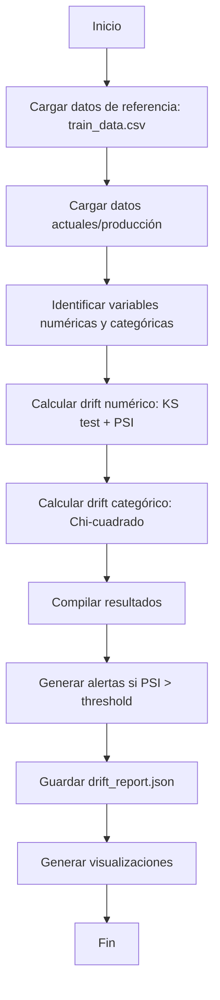

# Módulo: Monitoreo de Data Drift

## 1. Propósito

Este módulo implementa el **monitoreo de data drift** para detectar desviaciones en los datos de producción respecto a los datos de entrenamiento. Incluye:
- Detección de drift en variables numéricas (Kolmogorov-Smirnov test)
- Detección de drift en variables categóricas (Chi-cuadrado test)
- Cálculo de Population Stability Index (PSI)
- Generación de alertas automáticas
- Visualización de drift
- Reportes en JSON
- Dashboard interactivo con Streamlit

---

## 2. Instrucciones de Ejecución

### 2.1. Prerrequisitos
```powershell
# Activar entorno virtual
.\Proyecto-venv\Scripts\Activate.ps1

# Verificar que existan los datos de entrenamiento
# Debe existir: data/processed/train_data.csv
```

### 2.2. Ejecución del Script de Monitoreo

**Método 1: Como módulo Python**
```powershell
# Ejecutar análisis de drift
python -m mlops_pipeline.src.model_monitoring
```

**Método 2: Dashboard Streamlit (Recomendado)**
```powershell
# Iniciar dashboard interactivo
streamlit run mlops_pipeline/src/streamlit_app.py

# Abrirá automáticamente en: http://localhost:8501
```

### 2.3. Salidas Esperadas

El script generará:
```
data/metadata/
└── drift_report.json           # Reporte completo de drift

reports/plots/
├── drift_numerical.png         # Visualización de drift numérico
├── drift_categorical.png       # Visualización de drift categórico
└── psi_heatmap.png            # Heatmap de PSI
```

---

## 3. Mapeo de Requisitos del Checklist

| Requisito del Checklist | Archivo | Función/Línea (Aprox.) | Descripción |
|:---|:---|:---|:---|
| **¿Se implementa monitoreo de data drift?** | `model_monitoring.py` | Clase `DriftMonitor` (línea ~31) | Sistema completo de monitoreo |
| **¿Se usa Population Stability Index (PSI)?** | `model_monitoring.py` | `calculate_psi()` (línea ~75) | Cálculo de PSI para variables numéricas |
| **¿Se usa Kolmogorov-Smirnov test?** | `model_monitoring.py` | `detect_numerical_drift()` (línea ~159) | Test estadístico para drift numérico |
| **¿Se usa Chi-cuadrado test?** | `model_monitoring.py` | `detect_categorical_drift()` (línea ~215) | Test estadístico para drift categórico |
| **¿Se cargan datos de referencia?** | `model_monitoring.py` | `load_reference_data()` (línea ~61) | Carga de train_data.csv como referencia |
| **¿Se comparan distribuciones?** | `model_monitoring.py` | `analyze_drift()` (línea ~269) | Comparación completa de distribuciones |
| **¿Se generan alertas?** | `model_monitoring.py` | `generate_alerts()` (línea ~335) | Alertas basadas en umbrales |
| **¿Se define umbral de alerta?** | `model_monitoring.py` | `__init__()` (línea ~49) | `alert_threshold = 0.2` (configurable) |
| **¿Se genera drift_report.json?** | `model_monitoring.py` | `save_drift_report()` (línea ~383) | Exportación de reporte completo |
| **¿Se visualiza el drift?** | `streamlit_app.py` | Todo el dashboard | Interfaz web interactiva |
| **¿Se calculan métricas de drift por variable?** | `model_monitoring.py` | `analyze_drift()` (línea ~269) | PSI, KS statistic, p-value por variable |
| **¿Se proporciona dashboard de monitoreo?** | `streamlit_app.py` | Aplicación Streamlit completa | Dashboard con gráficos interactivos |

---

## 4. Arquitectura del Módulo

### 4.1. Clase Principal: `DriftMonitor`

```python
class DriftMonitor:
    def __init__(self, project_root: Path, alert_threshold: float = 0.2)
    def load_reference_data(self) -> pd.DataFrame
    def calculate_psi(self, reference: np.ndarray, current: np.ndarray, n_bins: int = 10) -> float
    def detect_numerical_drift(self, reference: pd.DataFrame, current: pd.DataFrame) -> Dict
    def detect_categorical_drift(self, reference: pd.DataFrame, current: pd.DataFrame) -> Dict
    def analyze_drift(self, current_data: pd.DataFrame) -> Dict[str, Any]
    def generate_alerts(self, drift_results: Dict[str, Any]) -> List[Dict[str, str]]
    def save_drift_report(self, drift_results: Dict[str, Any]) -> None
    def visualize_drift(self, drift_results: Dict[str, Any]) -> None
```

### 4.2. Flujo de Ejecución



---

## 5. Métodos de Detección de Drift

### 5.1. Population Stability Index (PSI)

```python
def calculate_psi(
    self,
    reference: np.ndarray,
    current: np.ndarray,
    n_bins: int = 10
) -> float:
    """
    Calcula el Population Stability Index.
    
    PSI = Σ [(% actual - % expected) * ln(% actual / % expected)]
    """
```

**Interpretación del PSI:**
- **PSI < 0.1:** Sin drift significativo (verde)
- **0.1 ≤ PSI < 0.2:** Drift moderado, requiere monitoreo (amarillo)
- **PSI ≥ 0.2:** Drift significativo, requiere acción (rojo)

### 5.2. Kolmogorov-Smirnov Test (Variables Numéricas)

```python
def detect_numerical_drift(
    self,
    reference: pd.DataFrame,
    current: pd.DataFrame
) -> Dict:
    """
    Detecta drift en variables numéricas usando KS test.
    
    Returns:
        Dict con 'statistic', 'p_value', 'psi' para cada variable
    """
```

**Interpretación:**
- **KS Statistic:** Distancia máxima entre las CDFs (0-1)
- **p-value < 0.05:** Evidencia de drift estadísticamente significativo
- **PSI:** Complementa el test con una métrica interpretable

### 5.3. Chi-Cuadrado Test (Variables Categóricas)

```python
def detect_categorical_drift(
    self,
    reference: pd.DataFrame,
    current: pd.DataFrame
) -> Dict:
    """
    Detecta drift en variables categóricas usando Chi-cuadrado.
    
    Returns:
        Dict con 'statistic', 'p_value', 'drift_detected' para cada variable
    """
```

**Interpretación:**
- **Chi-squared Statistic:** Medida de divergencia entre distribuciones
- **p-value < 0.05:** Las distribuciones son significativamente diferentes
- **Drift Detected:** Boolean indicando si hay drift

---

## 6. Sistema de Alertas

### 6.1. Generación de Alertas

```python
def generate_alerts(
    self,
    drift_results: Dict[str, Any]
) -> List[Dict[str, str]]:
    """
    Genera alertas basadas en PSI y p-values.
    
    Niveles de alerta:
    - HIGH: PSI >= 0.2
    - MODERATE: 0.1 <= PSI < 0.2
    - LOW: PSI < 0.1 pero p-value < 0.05
    """
```

### 6.2. Estructura de Alerta

```json
{
    "feature": "Age",
    "severity": "HIGH",
    "psi": 0.2534,
    "message": "Drift significativo detectado en Age (PSI=0.2534)",
    "recommendation": "Revisar distribución y considerar reentrenamiento"
}
```

### 6.3. Niveles de Severidad

| Nivel | Condición | Acción Recomendada |
|:---|:---|:---|
| **HIGH** | PSI ≥ 0.2 | Reentrenar modelo inmediatamente |
| **MODERATE** | 0.1 ≤ PSI < 0.2 | Monitorear de cerca, preparar reentrenamiento |
| **LOW** | PSI < 0.1 y p < 0.05 | Continuar monitoreando |

---

## 7. Reporte de Drift

### 7.1. Estructura del drift_report.json

```json
{
    "timestamp": "2025-11-10T15:30:00",
    "reference_data": {
        "n_samples": 8000,
        "date_range": "2023-01-01 to 2023-12-31"
    },
    "current_data": {
        "n_samples": 2000,
        "date_range": "2024-01-01 to 2024-03-31"
    },
    "numerical_drift": {
        "Age": {
            "ks_statistic": 0.0823,
            "p_value": 0.0012,
            "psi": 0.1456,
            "drift_detected": true
        },
        "CreditScore": {
            "ks_statistic": 0.0412,
            "p_value": 0.2341,
            "psi": 0.0823,
            "drift_detected": false
        }
    },
    "categorical_drift": {
        "Geography": {
            "chi2_statistic": 15.234,
            "p_value": 0.0003,
            "drift_detected": true
        }
    },
    "alerts": [
        {
            "feature": "Age",
            "severity": "MODERATE",
            "psi": 0.1456,
            "message": "Drift moderado en Age",
            "recommendation": "Monitorear de cerca"
        }
    ],
    "summary": {
        "total_features_monitored": 13,
        "features_with_drift": 2,
        "high_severity_alerts": 0,
        "moderate_severity_alerts": 1,
        "low_severity_alerts": 1
    }
}
```

---

## 8. Dashboard de Streamlit

### 8.1. Características del Dashboard

El archivo `streamlit_app.py` proporciona:

**1. Vista General:**
- Resumen de métricas de drift
- Contadores de alertas por severidad
- Timestamp del último análisis

**2. Visualizaciones Interactivas:**
- Gráfico de barras de PSI por variable
- Heatmap de p-values
- Distribuciones comparativas (reference vs current)
- Boxplots comparativos

**3. Tabla de Alertas:**
- Lista de todas las alertas activas
- Filtrado por severidad
- Recomendaciones de acción

**4. Análisis en Tiempo Real:**
- Botón para ejecutar nuevo análisis
- Recarga automática de resultados

### 8.2. Iniciar Dashboard

```powershell
# Iniciar aplicación Streamlit
streamlit run mlops_pipeline/src/streamlit_app.py

# Acceder en navegador:
# http://localhost:8501
```

### 8.3. Componentes del Dashboard

```python
# Código simplificado del dashboard
def main():
    st.title("📊 MLOps Monitoring Dashboard")
    
    # Cargar drift report
    drift_report = load_drift_report()
    
    # Sección 1: Métricas resumen
    col1, col2, col3 = st.columns(3)
    col1.metric("Features Monitoreados", total_features)
    col2.metric("Features con Drift", features_with_drift)
    col3.metric("Alertas Críticas", high_alerts)
    
    # Sección 2: Gráficos
    st.plotly_chart(plot_psi_chart(drift_report))
    st.plotly_chart(plot_distribution_comparison(drift_report))
    
    # Sección 3: Alertas
    st.subheader("🚨 Alertas Activas")
    st.table(display_alerts(drift_report))
    
    # Sección 4: Ejecutar nuevo análisis
    if st.button("Ejecutar Nuevo Análisis"):
        run_drift_analysis()
        st.experimental_rerun()
```

---

## 9. Configuración y Parámetros

### 9.1. Parámetros Configurables

| Parámetro | Ubicación | Default | Descripción |
|:---|:---|:---|:---|
| `alert_threshold` | `DriftMonitor.__init__()` | `0.2` | Umbral de PSI para alertas HIGH |
| `n_bins` | `calculate_psi()` | `10` | Número de bins para discretización PSI |
| `alpha` | Tests estadísticos | `0.05` | Nivel de significancia |

### 9.2. Modificar Umbrales

```python
# En model_monitoring.py
drift_monitor = DriftMonitor(
    project_root=project_root,
    alert_threshold=0.15  # Más estricto
)
```

---

## 10. Casos de Uso

### 10.1. Monitoreo Periódico (Scheduled)

```python
# Script para ejecución programada (ej: cron job)
import schedule
import time

def run_monitoring():
    from mlops_pipeline.src.model_monitoring import DriftMonitor
    from pathlib import Path
    
    monitor = DriftMonitor(Path(__file__).parent.parent.parent)
    monitor.load_reference_data()
    
    # Cargar datos de producción del último mes
    current_data = load_production_data()
    
    # Analizar drift
    results = monitor.analyze_drift(current_data)
    
    # Guardar reporte
    monitor.save_drift_report(results)
    
    # Enviar alertas si es necesario
    if results['summary']['high_severity_alerts'] > 0:
        send_email_alert(results)

# Programar ejecución diaria
schedule.every().day.at("02:00").do(run_monitoring)

while True:
    schedule.run_pending()
    time.sleep(3600)
```

### 10.2. Monitoreo en Tiempo Real (API)

```python
# Integración con API de predicción
@app.route('/predict', methods=['POST'])
def predict():
    data = request.json
    
    # Hacer predicción
    prediction = model.predict(data)
    
    # Guardar para monitoreo posterior
    save_for_monitoring(data)
    
    # Verificar drift periódicamente
    if should_check_drift():
        drift_results = monitor.analyze_drift(recent_data)
        if has_high_alerts(drift_results):
            logger.warning("Drift detectado en producción!")
    
    return jsonify({'prediction': prediction})
```

---

## 11. Interpretación de Resultados

### 11.1. Ejemplo de Análisis

**Escenario:** Después de 3 meses en producción

**Resultados:**
```
Variable          PSI      KS-stat   p-value   Drift?   Severity
Age               0.234    0.089     0.001     Yes      HIGH
CreditScore       0.078    0.034     0.321     No       -
Geography         -        15.23     0.0003    Yes      HIGH
Gender            -        2.45      0.118     No       -
```

**Interpretación:**
1. **Age:** Drift significativo (PSI=0.234). La distribución de edad ha cambiado.
   - **Acción:** Reentrenar modelo con datos recientes
   
2. **Geography:** Cambio en distribución geográfica de clientes
   - **Acción:** Verificar si hay expansión a nuevas regiones
   
3. **CreditScore:** Sin drift, distribución estable
   - **Acción:** Continuar monitoreando

---

## 12. Próximos Pasos

Después del monitoreo de drift:
1. **Si hay drift HIGH:** Reentrenar modelo con datos recientes
2. **Si hay drift MODERATE:** Incrementar frecuencia de monitoreo
3. **Desplegar API:** `python -m mlops_pipeline.src.model_deploy`
4. **Ver dashboard:** `streamlit run mlops_pipeline/src/streamlit_app.py`

---

## 13. Troubleshooting

### Problema: "No se encuentra drift_report.json"
**Solución:** Ejecutar `model_monitoring.py` primero para generar el reporte.

### Problema: "Todas las variables muestran drift"
**Solución:** Verificar que current_data y reference_data sean comparables.

### Problema: "Dashboard no muestra gráficos"
**Solución:** Verificar que drift_report.json tenga la estructura correcta.

---

## 14. Mejoras Futuras

### 14.1. Técnicas Avanzadas
- Implementar Evidently AI para drift automático
- Usar tests de permutación
- Detectar concept drift (cambio en la relación X-y)

### 14.2. Automatización
- Integración con sistema de CI/CD
- Reentrenamiento automático si drift > threshold
- Notificaciones por email/Slack

### 14.3. Visualización
- Gráficos temporales de PSI
- Comparación histórica de distribuciones
- Dashboard de métricas del modelo en producción

---

**Contacto:**  
Para preguntas sobre este módulo, referirse al README principal del proyecto.
