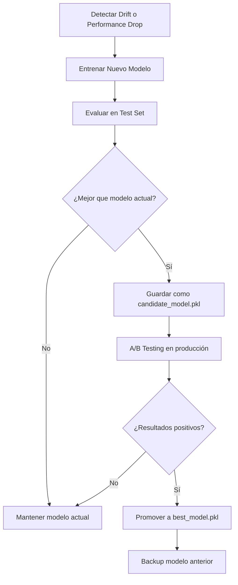

# Carpeta: Models

## 1. Propósito

Esta carpeta contiene **todos los artefactos de Machine Learning** necesarios para el despliegue y operación del modelo en producción:
- Modelo entrenado serializado
- Pipeline de preprocesamiento (preprocessor)
- Metadatos del modelo
- Configuración

---

## 2. Estructura de la Carpeta

```
models/
├── best_model.pkl              # Mejor modelo entrenado (serializado con joblib)
├── preprocessor.pkl            # Pipeline de preprocesamiento (ColumnTransformer)
├── model_metadata.json         # Metadatos del modelo (métricas, hiperparámetros)
└── config.json                 # Configuración adicional (opcional)
```

---

## 3. Descripción de Archivos

### 3.1. `best_model.pkl`

**Generado por:** `mlops_pipeline/src/model_training_evaluation.py`

**Contenido:** Objeto del mejor modelo de ML serializado con `joblib`.

**Modelos posibles:**
- `LogisticRegression`
- `DecisionTreeClassifier`
- `RandomForestClassifier` ⭐ (generalmente el mejor)
- `GradientBoostingClassifier`

**Tamaño aproximado:** 5-50 MB (depende del modelo)

**Cómo se selecciona:**
- Se entrenan 4 modelos
- Se evalúan con cross-validation
- Se selecciona el de mayor F1-Score
- Se serializa con `joblib.dump()`

**Ejemplo de uso:**
```python
import joblib

# Cargar modelo
model = joblib.load('models/best_model.pkl')

# Hacer predicción
prediction = model.predict(X_transformed)
probabilities = model.predict_proba(X_transformed)
```

**⚠️ IMPORTANTE:**
- **Siempre usar con el preprocessor correspondiente**
- No intentar usar con datos crudos
- Verificar compatibilidad de versiones de scikit-learn

---

### 3.2. `preprocessor.pkl`

**Generado por:** `mlops_pipeline/src/ft_engineering.py`

**Contenido:** Pipeline completo de preprocesamiento (sklearn `ColumnTransformer`).

**Transformaciones incluidas:**
1. **Variables numéricas continuas:**
   - SimpleImputer (strategy='median')
   - StandardScaler o MinMaxScaler

2. **Variables numéricas discretas:**
   - SimpleImputer (strategy='most_frequent')
   - StandardScaler o MinMaxScaler

3. **Variables categóricas:**
   - SimpleImputer (strategy='most_frequent')
   - OneHotEncoder (drop='first')

**Tamaño aproximado:** 10-100 KB

**Ejemplo de uso:**
```python
import joblib
import pandas as pd

# Cargar preprocessor
preprocessor = joblib.load('models/preprocessor.pkl')

# Transformar nuevos datos
new_data = pd.DataFrame({
    'CreditScore': [650],
    'Geography': ['France'],
    'Gender': ['Male'],
    'Age': [35],
    'Tenure': [5],
    'Balance': [120000.0],
    'NumOfProducts': [2],
    'HasCrCard': [1],
    'IsActiveMember': [1],
    'EstimatedSalary': [85000.0]
})

X_transformed = preprocessor.transform(new_data)
```

**⚠️ IMPORTANTE:**
- **Fit solo en datos de entrenamiento**
- **Transform en datos nuevos**
- Nunca hacer `fit_transform` en producción

---

### 3.3. `model_metadata.json`

**Generado por:** `mlops_pipeline/src/model_training_evaluation.py`

**Contenido:** Metadatos completos del modelo entrenado.

**Estructura:**
```json
{
    "model_name": "Random Forest",
    "model_type": "RandomForestClassifier",
    "timestamp": "2025-11-10T14:30:00",
    "sklearn_version": "1.3.0",
    "python_version": "3.10.0",
    "metrics": {
        "accuracy": 0.8650,
        "precision": 0.7234,
        "recall": 0.4893,
        "f1": 0.5834,
        "roc_auc": 0.8521
    },
    "cross_validation": {
        "cv_accuracy_mean": 0.8630,
        "cv_accuracy_std": 0.0042,
        "n_folds": 5
    },
    "hyperparameters": {
        "n_estimators": 100,
        "max_depth": 10,
        "min_samples_split": 20,
        "random_state": 42,
        "n_jobs": -1
    },
    "training_data": {
        "n_samples": 8000,
        "n_features": 15,
        "target_distribution": {
            "0": 6398,
            "1": 1602
        }
    },
    "test_data": {
        "n_samples": 2000,
        "n_features": 15
    },
    "feature_names": [
        "CreditScore", "Age", "Balance", "EstimatedSalary",
        "Tenure", "NumOfProducts", "HasCrCard", "IsActiveMember",
        "Geography_Germany", "Geography_Spain", "Gender_Male"
    ],
    "training_duration_seconds": 45.23
}
```

**Uso:**
- Documentación del modelo
- Endpoint `/model-info` de la API
- Trazabilidad y auditoría
- Comparación de versiones

---

### 3.4. `config.json`

**Contenido:** Configuración adicional del proyecto (opcional).

**Ejemplo:**
```json
{
    "project_name": "Churn Prediction MLOps",
    "version": "1.0.0",
    "target_column": "Exited",
    "model_registry": {
        "production": "best_model.pkl",
        "staging": "candidate_model.pkl"
    },
    "thresholds": {
        "churn_probability": 0.5,
        "high_risk": 0.7
    },
    "monitoring": {
        "psi_threshold": 0.2,
        "check_frequency": "daily"
    }
}
```

---

## 4. Versionado de Modelos

### 4.1. Estrategia de Versionado

**Opción 1: Timestamps**
```
models/
├── best_model_20251110_143000.pkl
├── best_model_20251109_102000.pkl
└── best_model.pkl -> best_model_20251110_143000.pkl  # Symlink
```

**Opción 2: Versionado Semántico**
```
models/
├── v1.0.0/
│   ├── model.pkl
│   ├── preprocessor.pkl
│   └── metadata.json
├── v1.1.0/
│   └── ...
└── production -> v1.0.0/  # Symlink
```

**Opción 3: MLflow Model Registry**
```python
import mlflow

# Registrar modelo
mlflow.sklearn.log_model(model, "churn_model")

# Promover a producción
client.transition_model_version_stage(
    name="churn_model",
    version=2,
    stage="Production"
)
```

### 4.2. ¿Qué versionar en Git?

**❌ NO versionar en Git:**
- `best_model.pkl` (puede ser muy grande, >10MB)
- Archivos `.pkl` en general

**✅ SÍ versionar en Git:**
- `model_metadata.json` (siempre)
- `config.json` (siempre)
- Scripts de entrenamiento

**Alternativas para modelos grandes:**
- **Git LFS** (Large File Storage)
- **DVC** (Data Version Control)
- **MLflow** (Model Registry)
- **Cloud Storage** (S3, Azure Blob)

---

## 5. Carga y Uso de Modelos

### 5.1. En la API de Deployment

```python
# En model_deploy.py
import joblib
from pathlib import Path

# Cargar artefactos
MODEL = joblib.load('models/best_model.pkl')
PREPROCESSOR = joblib.load('models/preprocessor.pkl')

# Predicción completa
def predict(raw_data):
    # 1. Preprocesar
    X_transformed = PREPROCESSOR.transform(raw_data)
    
    # 2. Predecir
    prediction = MODEL.predict(X_transformed)
    probability = MODEL.predict_proba(X_transformed)
    
    return prediction, probability
```

### 5.2. En Notebooks o Scripts

```python
import joblib
import pandas as pd

# Cargar modelo y preprocessor
model = joblib.load('models/best_model.pkl')
preprocessor = joblib.load('models/preprocessor.pkl')

# Nuevos datos
new_customer = pd.DataFrame({...})

# Pipeline completo
X_transformed = preprocessor.transform(new_customer)
prediction = model.predict(X_transformed)
probability = model.predict_proba(X_transformed)

print(f"Predicción: {prediction[0]}")
print(f"Probabilidad de churn: {probability[0][1]:.2%}")
```

---

## 6. Compatibilidad y Dependencias

### 6.1. Versiones Críticas

**⚠️ IMPORTANTE:** Los modelos serializados con joblib son sensibles a las versiones de:

| Librería | Versión Requerida | Razón |
|:---|:---|:---|
| **scikit-learn** | 1.3.0+ | Serialización del modelo |
| **numpy** | 1.24.0+ | Dependencia de sklearn |
| **pandas** | 2.0.0+ | Procesamiento de datos |
| **joblib** | 1.3.0+ | Serialización |

**Verificar compatibilidad:**
```python
import sklearn
import joblib

print(f"scikit-learn version: {sklearn.__version__}")
print(f"joblib version: {joblib.__version__}")

# Al cargar modelo
model = joblib.load('models/best_model.pkl')
print(f"Model type: {type(model)}")
```

### 6.2. Problemas de Compatibilidad

**Error común:**
```
ModuleNotFoundError: No module named 'sklearn.ensemble._forest'
```

**Causa:** Diferencia de versiones de scikit-learn.

**Solución:**
```powershell
# Verificar versión usada en entrenamiento (en model_metadata.json)
# Instalar misma versión
pip install scikit-learn==1.3.0
```

---

## 7. Buenas Prácticas

### 7.1. Checklist de Modelo en Producción

Antes de desplegar un modelo, verificar:

- [ ] Modelo serializado correctamente (`best_model.pkl`)
- [ ] Preprocessor guardado (`preprocessor.pkl`)
- [ ] Metadatos completos (`model_metadata.json`)
- [ ] Versiones de librerías documentadas
- [ ] Métricas de evaluación aceptables (F1 > 0.5)
- [ ] Modelo probado con datos nuevos
- [ ] Compatibilidad con API verificada
- [ ] Backup del modelo anterior (si existe)

### 7.2. Seguridad

**Consideraciones:**
1. **No exponer modelos públicamente** sin autenticación
2. **Validar inputs** antes de predecir
3. **Rate limiting** en API
4. **Logging** de predicciones para auditoría
5. **Encryption** de modelos sensibles

### 7.3. Monitoreo

**Métricas a rastrear:**
- Distribución de predicciones (% churn predicho)
- Tiempo de inferencia (latencia)
- Uso de memoria
- Drift en features
- Feedback de negocio (si disponible)

---

## 8. Actualización de Modelos

### 8.1. Flujo de Reentrenamiento



### 8.2. Comandos para Actualizar

```powershell
# 1. Backup del modelo actual
Copy-Item models/best_model.pkl models/best_model_backup_$(Get-Date -Format "yyyyMMdd_HHmmss").pkl

# 2. Reentrenar modelo
python -m mlops_pipeline.src.model_training_evaluation

# 3. Verificar nuevo modelo
python -c "import joblib; m = joblib.load('models/best_model.pkl'); print(type(m))"

# 4. Reiniciar API
# (El nuevo modelo se cargará automáticamente)
```

---

## 9. Troubleshooting

### Problema: "EOFError al cargar modelo"
**Causa:** Archivo corrupto o transferencia incompleta.
**Solución:** Re-entrenar modelo o restaurar backup.

### Problema: "Model predictions are all the same class"
**Causa:** Modelo no entrenado correctamente o threshold incorrecto.
**Solución:** Verificar balance de clases y reentrenar.

### Problema: "MemoryError al cargar modelo"
**Causa:** Modelo muy grande para memoria disponible.
**Solución:** Usar modelo más simple o aumentar memoria.

### Problema: "Preprocessor y modelo incompatibles"
**Causa:** Fueron generados con datasets diferentes.
**Solución:** Regenerar ambos desde el mismo pipeline.

---

## 10. Estadísticas

### 10.1. Tamaños de Archivos

| Archivo | Tamaño Típico | Rango |
|:---|:---|:---|
| `best_model.pkl` | 15-30 MB | 5-50 MB |
| `preprocessor.pkl` | 50 KB | 10-100 KB |
| `model_metadata.json` | 5 KB | 2-10 KB |

**Total aproximado:** 15-30 MB

### 10.2. Tiempo de Carga

| Operación | Tiempo Típico |
|:---|:---|
| Cargar modelo | 100-500 ms |
| Cargar preprocessor | 10-50 ms |
| Predicción (1 instancia) | 1-5 ms |
| Predicción (batch 1000) | 50-200 ms |

---

## 11. Contacto

Para preguntas sobre los modelos del proyecto, referirse al README principal.

**Documentación relacionada:**
- [README Model Training](../docs/README_MODEL_TRAINING.md)
- [README Feature Engineering](../docs/README_FEATURE_ENGINEERING.md)
- [README Deployment](../docs/README_DEPLOYMENT.md)
